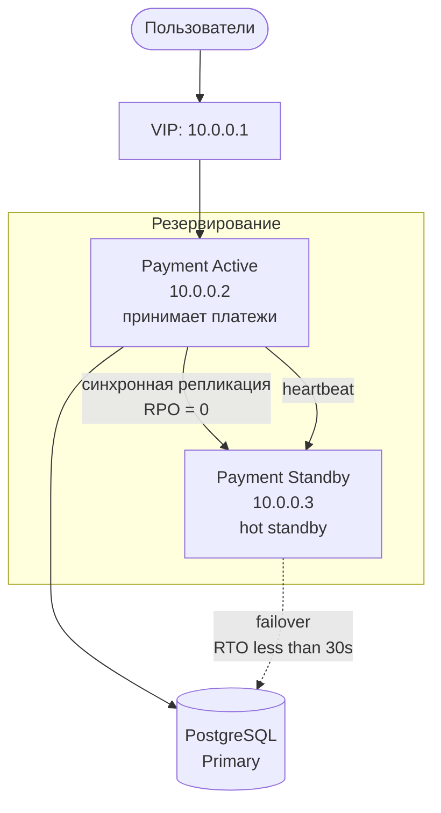
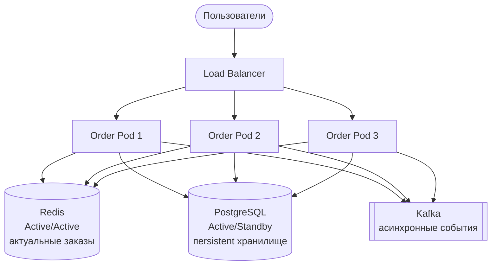
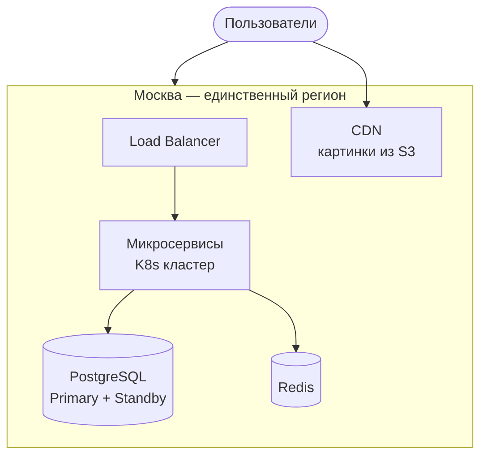
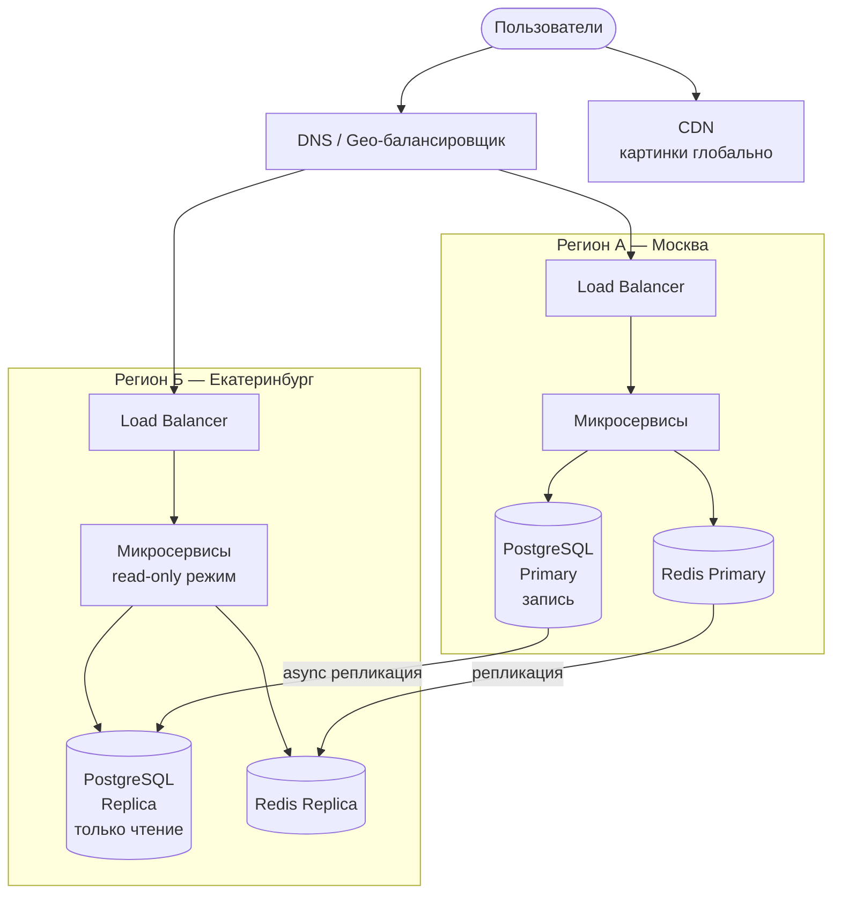
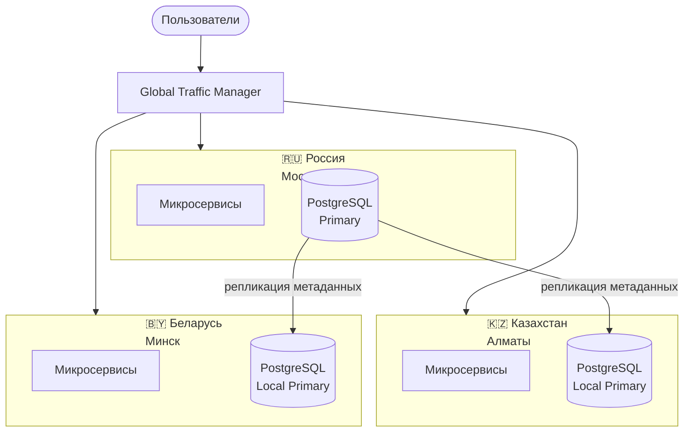
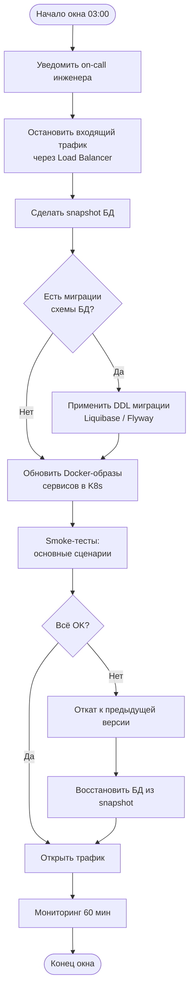
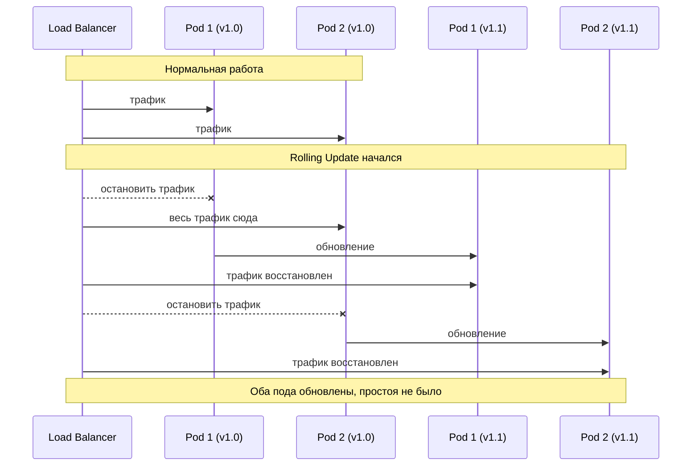
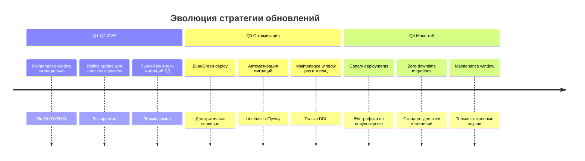

# JetMeal — Доступность сервиса

## 1. Целевая доступность системы

| Компонент | Uptime | Допустимый простой/год |
|-----------|--------|----------------------|
| Оплата | 99.9% | ~8.7 часов |
| Подтверждение заказа | 99.9% | ~8.7 часов |
| Уведомления | 99.5% | ~43 часа |
| Формирование заказа | 99.0% | ~87 часов |
| Поиск ресторанов | 99.0% | ~87 часов |
| Трекинг курьера | 99.0% | ~87 часов |

> **Почему не 99.99%?**
> Команда 5 человек, MVP, ограниченный бюджет.
> 99.9% — разумный баланс между стоимостью и надёжностью на старте.

---

## 2. RPO и RTO для критичных компонентов

**RPO (Recovery Point Objective)** — допустимая потеря данных (сколько времени назад).
**RTO (Recovery Time Objective)** — время восстановления после сбоя.

| Компонент | RPO | RTO | Обоснование |
|-----------|-----|-----|-------------|
| Order Service | 0 сек | < 30 сек | Потеря оплаченного заказа — прямой финансовый ущерб. < 0.000001% |
| Payment Service | 0 сек | < 30 сек | Финансовые данные — нельзя потерять ни одну запись |
| User/Auth Service | 1 мин | < 1 мин | Без авторизации не работает ни один сервис |
| Business/Menu Service | 5 мин | < 2 мин | Меню меняется редко, небольшая потеря допустима |
| Tracking/Delivery | 30 сек | < 1 мин | Активные заказы критичны, история — нет |
| Geo Service | 5 мин | < 2 мин | Данные маршрутов восстановимы пересчётом |
| Notifications Service | 5 мин | < 5 мин | Уведомление с задержкой — не катастрофа |
| Statistics Service | 1 час | < 1 часа | Аналитика некритична для работы бизнеса |

---

## 3. Стратегия резервирования

### 3.1 Сводная таблица

| Компонент               | Стратегия              | Геораспределение | Причина |
|-------------------------|------------------------|------------------|--------------------------------------------------|
| Order Service           | Active/Active          | Этап 2+          | Stateless логика, состояние в PG и Redis |
| Payment Service         | Active/Standby (hot)   | Этап 2+          | Риск двойного списания при split-brain |
| User/Auth Service       | Active/Active          | Этап 2+          | Stateless JWT-токены, PG — A/S |
| Business/Menu Service   | Active/Active          | Этап 2+          | Read-heavy, данные кешируются в Redis |
| Tracking/Delivery       | A/A (Redis) + A/S (PG) | Этап 2+          | Горячий путь через Redis, история в PG |
| Geo Service             | Active/Active          | Этап 2+          | Stateless вычисления маршрутов |
| Notifications Service   | Active/Active          | Этап 2+          | Idempotent отправка, потеря одного уведомления допустима |
| Statistics Service      | Active/Standby (warm)  | Этап 3           | Некритичный сервис, экономия на инфре |

---

### 3.2 Payment Service — Active/Standby

Выбрана стратегия **Active/Standby**, потому что Active/Active создаёт риск split-brain
и двойного списания средств с карты пользователя.

Механизм переключения:

1. Standby отслеживает heartbeat от Active каждые 5 секунд
2. После 30 секунд без ответа — инициирует failover
3. VIP переезжает на Standby — пользователи продолжают работу
4. Бывший Active при восстановлении становится новым Standby

### 3.3 Order Service — Active/Active

Бизнес-логика stateless (оркестрация через Kafka), состояние хранится в PostgreSQL и Redis.
При падении одного пода Load Balancer мгновенно переключает трафик — failover не нужен.

### 3.4 Tracking Service — гибридная стратегия

Высокий RPS на чтение статуса заказа (5500 RPS) требует разделения:

- Redis A/A — горячий путь, актуальные координаты курьера (RPO = 30 сек)
- PostgreSQL A/S — история чекпоинтов, данные о курьерах (async репликация)

### 3.5 Геораспределённость

Этап 1 — MVP (Q1–Q2): один регион

Почему один регион достаточно на старте:

>   Москва — 80% целевой аудитории (из допущений)
>   Команда 5 человек: геораспределение кратно увеличивает сложность
>   99.9% uptime достижимо в одном ЦОД с резервированием
>   Бюджет ограничен

Что не покрывает один регион:

- Авария/пожар в ЦОД
- Региональный сбой облачного провайдера
- Высокая latency для пользователей из других регионов

Этап 2 — Рост (Q3–Q4): read-реплики и CDN

Правила маршрутизации:

- Запись (создать заказ, оплата) → всегда Регион А (Москва)
- Чтение (меню, история заказов, статус) → ближайший регион
- Картинки → CDN глобально, без обращения к бэкенду

Этап 3 — СНГ: полная геораспределённость

Причины отдельных инстансов:

> Локальные платёжные системы (Kaspi, ЕРИП)
> Data sovereignty — данные граждан хранятся локально
> Снижение latency для пользователей

## 4. Maintenance Window

## 4. Maintenance Window

### 4.1 Нужен ли он?

| Этап | Maintenance Window | Причина |
|------|--------------------|---------|
| MVP (Q1–Q2) | Да, еженедельно | Нет зрелого CI/CD, миграции БД требуют контроля |
| Рост (Q3) | Раз в месяц | Автоматизация миграций, Blue/Green deploy |
| Масштаб (Q4+) | Только экстренно | Zero-downtime как стандарт |

---

### 4.2 Расписание на период MVP

**Почему воскресенье 03:00–05:00:**
- Пиковая нагрузка (НФТ-003): 13:00–16:00 и 19:00–21:00
- Воскресная ночь — минимальное количество активных заказов
- 2-часовой запас перед возможным утренним трафиком

| Время | Действие |
|-------|----------|
| 03:00 | Остановка входящего трафика |
| 03:05 | Резервное копирование БД |
| 03:20 | Применение миграций схемы БД |
| 03:50 | Обновление сервисов |
| 04:30 | Smoke-тесты и проверка работоспособности |
| 04:50 | Открытие трафика |
| 05:00 | Наблюдение за метриками (60 мин) |

---

### 4.3 Что делается в окно

### 4.4 Как минимизируем простой уже сейчас

Stateless сервисы — Rolling Update без остановки трафика

### 4.5 Дорожная карта к нулевому простою

