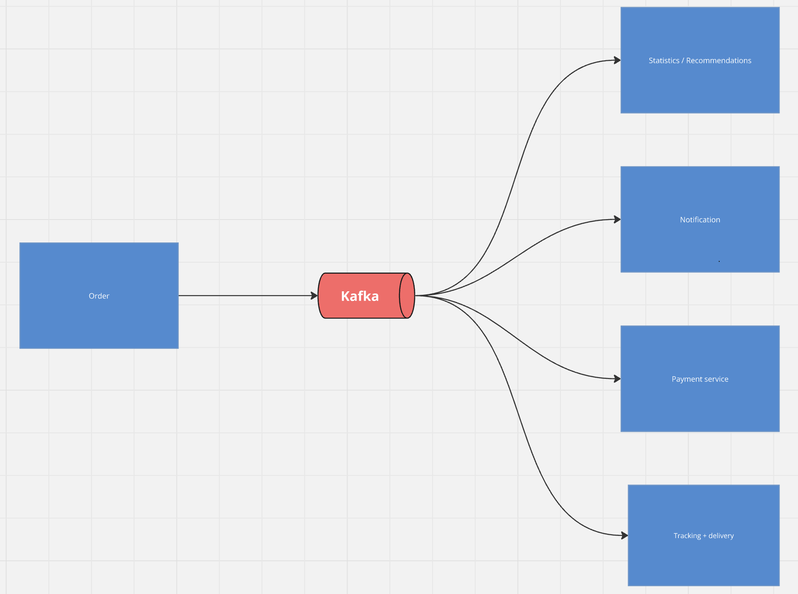

# ADR 01 топик событий об изменении статуса заказа

## Проблематика

Обработка и выполнение заказов - ключевая функциональность нашей системы. После создания заказа непосредственно в сервисе `order` он должен быть обработан в нескольких других сервисах (нотификации, поиск курьера, доведение информации до бизнеса и т.д. ). При этом кратковременный отказ одного из них не должен приводить к остановке потока создания заказов, могут появиться новые сервисы, которые нужно уведомлять о создании или изменении информации о заказе. 

## Решение



- Создание топика kafka с событиями создания и изменения заказов. Поставлять сообщения будет сервис `order`, потребители на первом этапе - сервисы `notification`, `payment`, `delivery`, `recommendations`. 
- С помощью ключа идемпотентности будет достигаться exectly once гарантия доставки.

- Типы событий `created` - создание заказа, `updated` - изменение информации (найден курьер, клиент изменил дату или место и т. д.), `cancelled` - заказ отменен - нужно выполнить компенсирующие операции в сервисах, которые уже успели обработать оформление заказа - отмена необходимости оплаты / возврат средств, освобождение курьера, отмена отправки нотификации / нотификация об отмена заказа.

- Каждый сервис-потребитель будет иметь возможность обрабатывать только нужные ему сообщения.

- Пример сообщения:

```json
{
    "event_type": "created",
    "user_id": "47885f9b-b5a7-4f6e-a3e4-5e1168694094",
    "restraunt_id": "6ab1aa47-c31d-49f7-9c6a-b60e8cfa7484",
    "total_cost": 1234.56,
    "menu_items": {
        "1034a504-3116-4e0f-a9a0-3c9a87a4e24d": 1,
        "b5de09fd-93cc-46da-9bcf-99d9ebd624e2": 2,
        "453b065a-d806-452a-b687-9d48543a736a": 2
    },
    "comment": "Leave next to the front door",
    "timestamp": "2026-04-01T05:43:01.317Z",
}
```

- Сервис `order` будет также принимать callback сообщения от сервисов - уведомления о том, что они обработали свою часть логики для данного заказа и ждут дальнейших ивентов. В таком случае достаточно будет обновить информацию о заказе и при необходимости произвести новое сообщение в топик.

## Последствия

### Плюсы от внедрения

- Улучшится отказоустойчивость системы, в случае сбоев деградация будет контролируемой
- Увеличится скорость создания заказов и оповещения пользователя с переходом на асинхронный формат взаимодействия
- Упростится логика сервиса `order`, она не будет зависеть от потребителей событий
- Новые сервисы достаточно будет подключить к уже существующему топику.

### Минусы

- Деградация кластера Kafka или нарушение контрактов приведет к параличу всей системы - это будет единая точка отказа.

- Дополнительные издержки на поддержани инфраструктуры, мониторинг и реплицирование брокера сообщений. Для него нужно выделить диск с хорошей пропускной способностью

- Для некоторых сервисов часть информации будет избыточной.

## Альтернативные предложения

- Пуллинг статуса заказов из сервиса `order`. Отказываемся из-за повышения нагрузки на критичный сервис и его бд.

- Синхронная отправка сообщений в остальные сервисы из `order`. Повысила бы нагрузку на сервис `order` и скорость ожидания создания заказа для клиента, добавление новых взаимодействий требует работ сразу в двух сервисах.

## Статус

Внедряется
