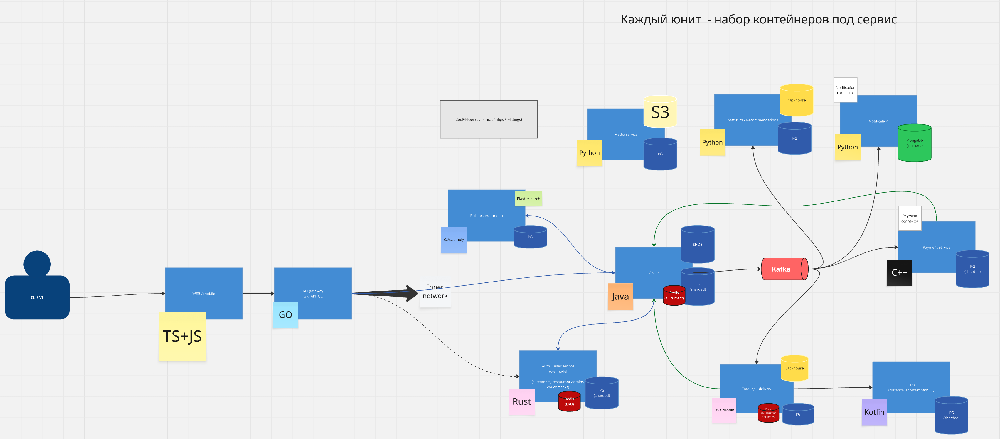
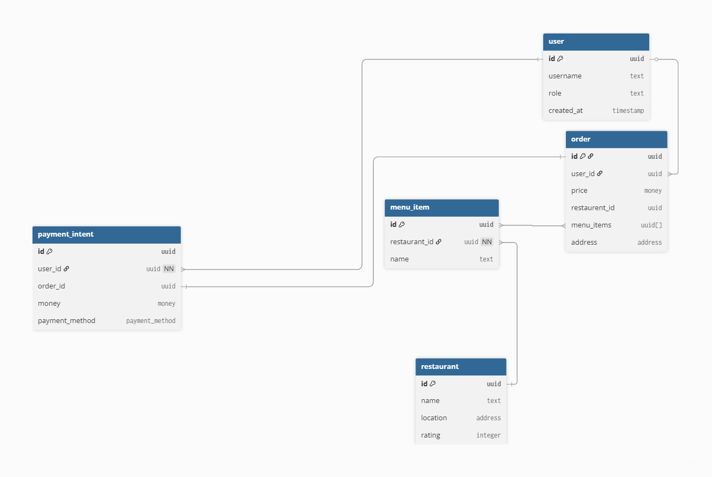

# JetMeal
## Часть 1: Архитектура системы (5–10 компонентов)
В проекте используется микросервисная архитектура: используется набор сервисов, четко выполняющих отдельные бизнес-требования. Есть элементы event-driven архитектуры: для части операций используется асинхронное взаимодействие через очередь сообщений.

### Верхнеуровневая архитектура

### Описание сервисов
- Businesses + menu service: Язык - C, кастомный веб-ферймворк. Информация о ресторанах и их ассортименте.
- Statistics/Recommendations service: Язык - python. Сбор действий пользователей и генерация рекомендаций.
- Notifications service: Язык - python. Отправка уведомлений о статусе заказа.
- Payment service: Язык - C++. Обработка платежей, взаимодействие с платежным шлюзом.
- Geo Service: Язык - Kotlin. Рассчет маршрутов, поиск ближаших курьеров/ресторанов.
- Tracking + delivery service: язык - Java+Kotlin. Логика доставки заказа: назначение курьера, рассчет маршрута и оставшегося времени.
- User + Auth service: язык - Rust. Общая информация о юзере + аутентификация.
- Order service: язык - Java. Центральный сервис, оркестрация обработки пайплайна заказа.

## Часть 4: Выбор БД и модель данных
Основная БД - PostgreSQL - самое популярное решение для крудов, хорошо себя зарекомендовало
- Business + Menu: PostgreSQL (шардирование не нужно, не будет много изменений и относительно маленький объем данных), ElasticSearch для поиска по меню.
- Media сервис S3 (MinIO) для хранения изображений и видео
- Statistics service - Clickhouse для OLAP операций и быстрых добавлений, PG для вспомогательных данных
- Notifications service - MongoDB для хранения контактных данных пользователей в гибком виде - разные способы нотификации и настройки. Шардирование бд (тк информация по большому количеству пользователь ключ - id пользователя).
- Payment service - PostgreSQL с шардированием (ключ - id пользователя), для обработки потенциально большого количества данных об оплатах
- GeoService - PostgreSQL с геоиндексом для хранения и обработки геоданных (возможно шардирование по городу)
- Tracking/delivery - Clickhouse (для хранения чекпоинтов передвижения) + PostgreSQL для хранения информации о курьерах + - Redis для кэширования информации об актуальном положении курьеров
- User/Auth service - PostgreSQL (шардирование по пользователю) - общие данные о пользователе + аутентификация. Redis для LRU кэша
- Order service - PostgreSQL (шардирование по id пользователя) для общей информации по заказу, Redis для актуального состояния активных заказов.

### Схема основных таблиц

GET /api/v1/restaurants/{restaurant_id}/menu
Описание: Возвращает список доступных блюд с ценами и изображениями для конкретного ресторана. Поддерживает фильтр по категориям
Request:
  {
    "category": "sushi"
  }
Response 200:
  {
    "restaurant_id": "uuid",
    "items": [
      {
        "menu_item_id": "uuid",
        "name": "Филадельфия ролл",
        "description": "Лосось, сливочный сыр, огурец, рис, нори",
        "price": {
          "amount": "650.00",
          "currency": "RUB"
        },
        "category": "sushi",
        "images": [
          {
            "media_id": "uuid",
            "url": "https://example.com/images/roll_philadelphia_1.jpg"
          }
        ],
        "available": true
      }
    ],
  }
Errors:
  400 - невалидные данные
  404 - ресторан не найден
  429 - rate limit exceeded
  503 - menu сервис недоступен
Подход к версионированию: v1 в URL. При обратной несовместимости (например, изменении структуры поля images) создаём /api/v2/.

POST /api/v1/orders
Описание: Создание нового заказа пользователем на основе позиций меню
Request:
  {
    "user_id": "uuid",
    "restaurant_id": "uuid",
    "items": [
      {
        "menu_item_id": "uuid",
        "quantity": 2,
        "comment": "без лука"
      }
    ],
    "delivery_address": {
      "street": "Проспект Андропова, 18",
      "lat": 55.69,
      "lon": 37.66
    },
    "payment_method": "card_online",
    "promo_code": "SPRING10"
  }
Response 201:
  {
    "order_id": "uuid",
    "status": "created",
    "total_price": {
      "amount": "1490.00",
      "currency": "RUB"
    }
  }
Errors:
  400 - невалидные данные заказа
  404 - ресторан или блюдо не найдено
  409 - блюдо недоступно/остаток изменился
  422 - адрес вне зоны доставки
  503 - order service недоступен
Подход к версионированию: v1 в URL; несовместимые изменения в модели items/price breakdown ведут к /api/v2/.

GET /api/v1/users/{user_id}/orders
Описание: Получение списка заказов пользователя
Request:
  {
    "limit": 20,
    "page_token": "opaque-token-1"
  }
Response 200:
  {
    "items": [
      {
        "order_id": "uuid",
        "status": "delivered",
        "created_at": "2026-04-24T17:10:00Z",
        "total_price": {
          "amount": "1490.00",
          "currency": "RUB"
        }
      }
    ],
    "next_page_token": "opaque-token-2"
  }
Errors:
  400 - невалидные параметры пагинации
  404 - пользователь не найден
  429 - rate limit exceeded
  503 - order service недоступен
Подход к версионированию: v1 в URL; при изменении модели пагинации или состава item создаем /api/v2/.
