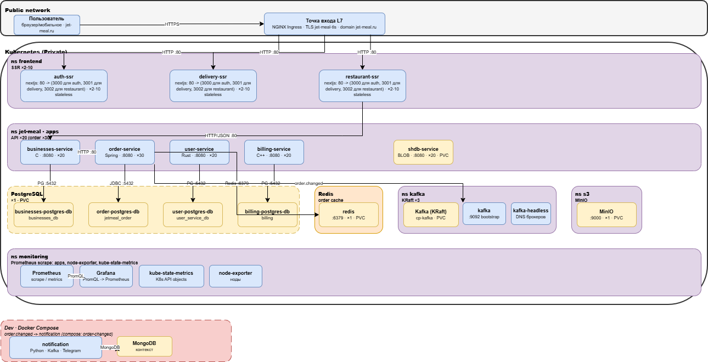
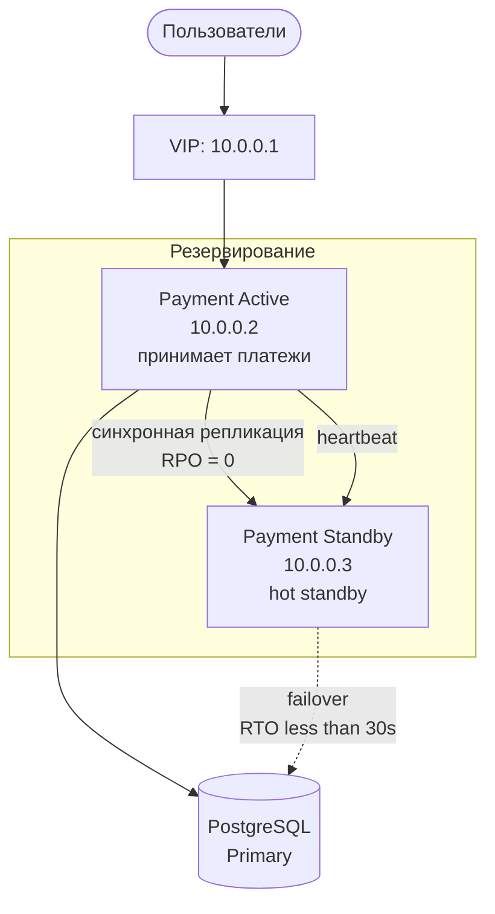
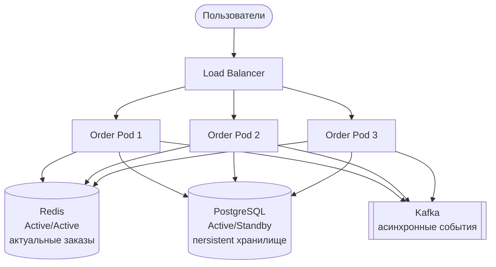
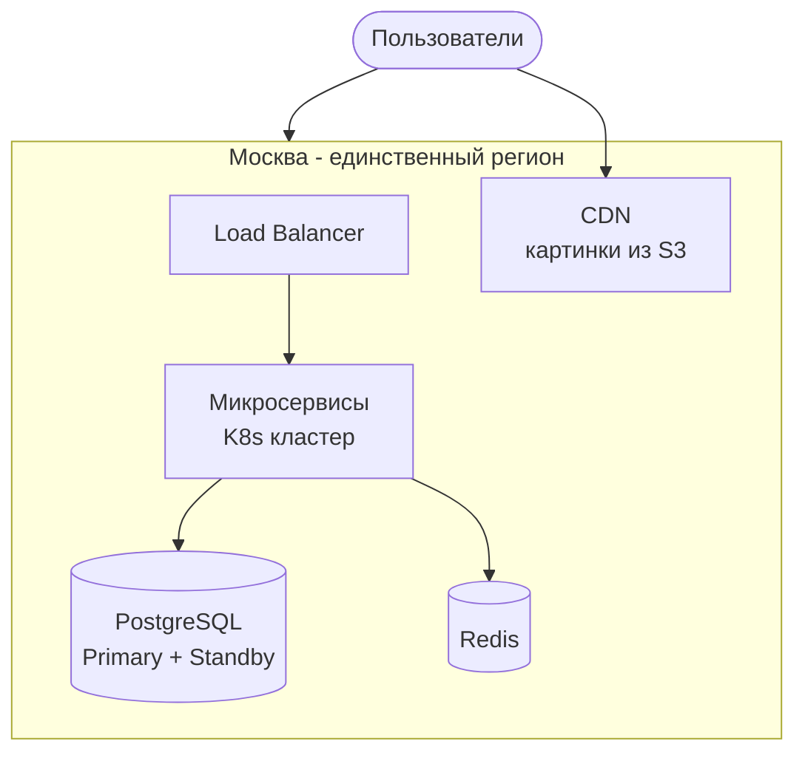
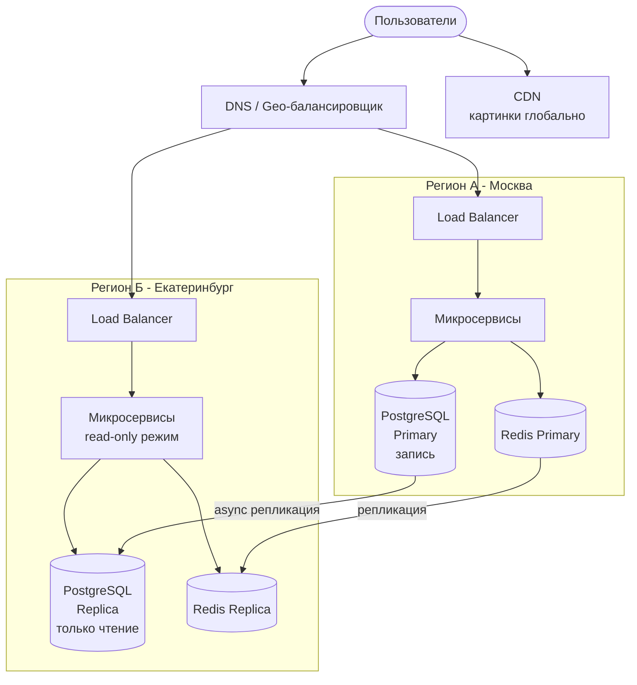
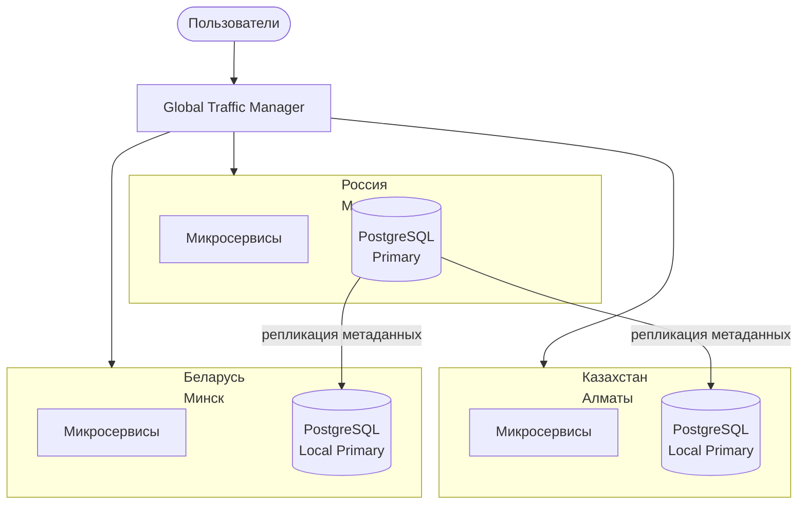
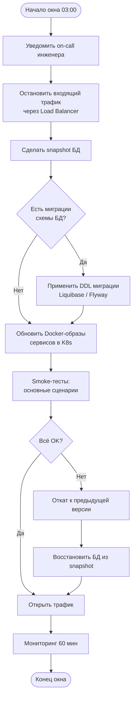
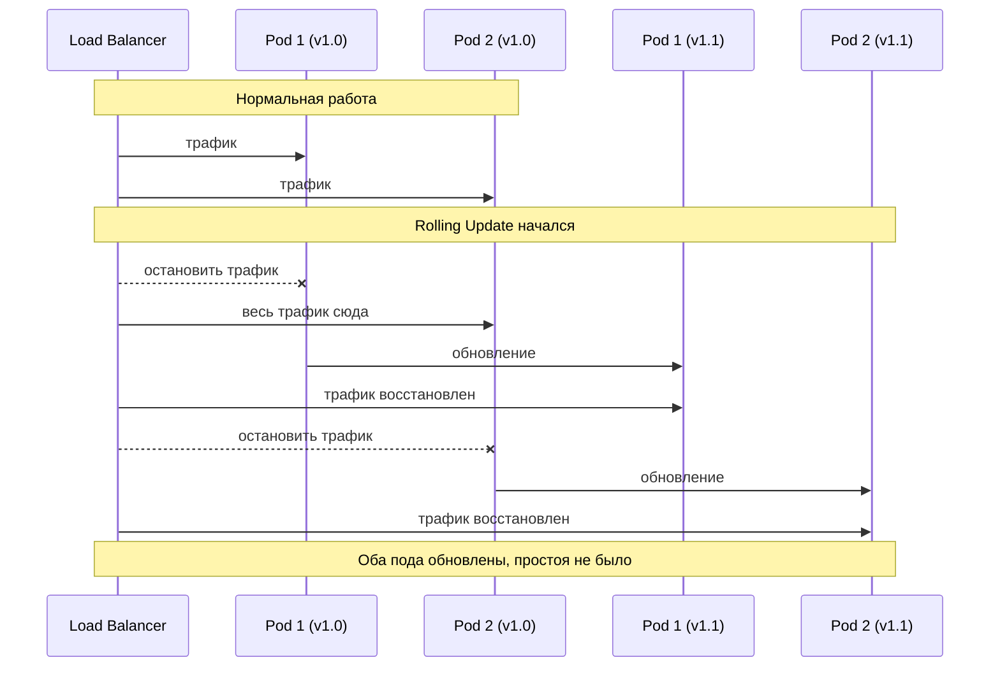
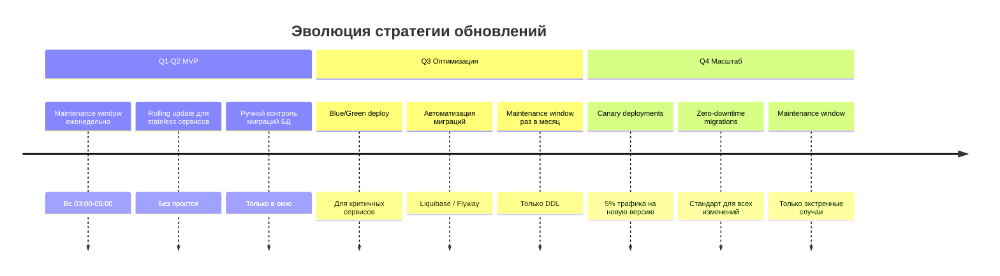

# Deployment документ

## 1.1. Описание развёртывания

### Система и нагрузка

Kubernetes-кластер с неймспейсами приложений `jet-meal` и `frontend`, инфраструктурными неймспейсами `kafka`, `s3`, `monitoring`. Внешний трафик принимает **NGINX Ingress** с TLS (`jet-meal-tls`), хост **jet-meal.ru**.

Нагрузка преобладает на чтение: каталог ресторанов и карточки меню, пики в обед и вечером. Записи сосредоточены в order-service: PostgreSQL, Redis-кэш активных заказов, события в Kafka.

### Сервисы

| Компонент | Ответственность | Stateful | Публичный |
|---|---|---|---|
| auth-ssr x2-10 | Аутентификация, профиль, `/account`, `/my`, `/admin`, `/` | Нет | Через Ingress |
| delivery-ssr x2-10 | Интерфейс заказов `/my/orders`, `/my/order`, `/admin/delivery` | Нет | Через Ingress |
| restaurant-ssr x2-10 | Витрина `/restaurants`, `/catalog`, `/admin/restaurants` | Нет | Через Ingress |
| businesses-service x20 | Рестораны и меню, GraphQL | Нет | Нет |
| order-service x30 | Заказы, Liquibase-миграции, Redis-кэш, producer `order.changed` | Нет | Нет |
| user-service x20 | Пользователи | Нет | Нет |
| billing-service x20 | Биллинг | Нет | Нет |
| shdb-service x1 | BLOB-хранилище на файловом томе | Да (PVC) | Нет |
| redis x1 | Кэш активных заказов | Да (PVC) | Нет |
| PostgreSQL StatefulSet x1 на сервис | Персистентность businesses, order, user, billing | Да (PVC) | Нет |
| Kafka x3 брокера | Топик `order.changed`, режим KRaft | Да (PVC) | Нет |
| MinIO x1 | Объектное хранилище, S3 API, неймспейс `s3` | Да (PVC) | Нет |
| Prometheus x1 | TSDB метрик, scrape по аннотации `prometheus.io/scrape` | Да (emptyDir) | Через monitoring Ingress |
| Grafana | Дашборды | Нет | Через monitoring Ingress |
| kube-state-metrics, node-exporter | Экспортёры кластера и нод | Нет | Нет |
| notification (Docker Compose) | Consumer `order.changed`, Telegram-уведомления, MongoDB | Да (volume MongoDB) | Порт 8081 на хосте |

Топик **order.changed**: producer - order-service в кластере, consumer - notification в Docker Compose (собственный Kafka-брокер внутри Compose).

---

## 1.2. Стратегия деплоя

### auth-ssr, delivery-ssr, restaurant-ssr: Canary

На каждое приложение два Deployment (`*-stable` и `*-canary`) и два ClusterIP Service. Основной Ingress направляет трафик на stable-Service. Второй Ingress на тот же хост и path содержит аннотации `nginx.ingress.kubernetes.io/canary: "true"` и `nginx.ingress.kubernetes.io/canary-weight` с долей трафика на новую сборку. При деградации по ошибкам или задержкам `canary-weight` выставляют в `0`. После стабильных метрик вес поднимают до 100; в следующем релизе canary-Deployment переименовывают в единственный stable.

### businesses-service, user-service, billing-service: Canary

На каждый сервис два Deployment (`*-stable` и `*-canary`) и два ClusterIP Service. Ingress направляет долю трафика на canary через аннотации `nginx.ingress.kubernetes.io/canary: "true"` и `nginx.ingress.kubernetes.io/canary-weight`. При деградации `canary-weight` выставляют в `0`. После стабильных метрик вес поднимают до 100; в следующем релизе canary-Deployment становится единственным stable. Миграции PostgreSQL только в стиле expand-contract.

### order-service: Rolling Update

Deployment с двумя репликами. Liquibase применяет миграции при старте пода (`SPRING_LIQUIBASE_CHANGE_LOG`); каждый шаг схемы совместим со старой версией приложения. События `order.changed` версионируются независимо от SQL.

### Kafka: StatefulSet, обновление по одному брокеру

Три брокера в StatefulSet, режим KRaft. Обновление образа идёт по очереди с сохранением PVC и кворума.

### PostgreSQL: обслуживание

Один StatefulSet на сервис. Обновление образа и DDL-операции вне цикла expand-contract выполняют в запланированном окне обслуживания.

### redis, shdb-service, MinIO: Rolling (одиночный Pod)

По одному Pod. Замена образа вызывает rolling этого пода; доступность прерывается до готовности нового пода.

### Zero-downtime: пробы и завершение

Readiness-проба снимает Pod с балансировки, пока сервис не готов. Liveness-проба перезапускает зависший процесс.

| Компонент | Liveness | Readiness |
|---|---|---|
| businesses-service | HTTP GET `/health` :8080 | HTTP GET `/health` :8080 |
| user-service | HTTP GET `/health` :8080 | HTTP GET `/health` :8080 |
| billing-service | HTTP GET `/health` :8080 | HTTP GET `/health` :8080 |
| shdb-service | HTTP GET `/health` :8080 | HTTP GET `/health` :8080 |
| order-service | TCP :8080 | TCP :8080 |
| auth-ssr / delivery-ssr / restaurant-ssr | HTTP GET `/` :3000 | HTTP GET `/` :3000 |
| redis | TCP :6379 | exec `redis-cli ping` |
| Kafka | exec `nc -z localhost 9092` | exec `kafka-broker-api-versions.sh` |
| notification (Compose) | нет | HTTP GET `/health/live` :8080 |

По SIGTERM приложение прекращает приём новых запросов, завершает открытые соединения к PostgreSQL и Kafka и выходит. Время ожидания задаёт `terminationGracePeriodSeconds`.

### Миграции БД: expand-contract

1. Выкатить миграцию: добавить новые поля или таблицы, совместимые со старым кодом.
2. Rolling-обновление сервиса.
3. Отдельный шаг: удалить устаревшие объекты схемы.

События Kafka версионируются отдельно и остаются обратно совместимыми на переходный период.

---

## 1.3. Observability

### Четыре алерта по Golden Signals (critical path)

Critical path: пользователь -> NGINX Ingress -> SSR -> businesses-service / order-service -> PostgreSQL, Redis, Kafka.

| # | Сигнал | Метрика | Порог | Окно |
|---|---|---|---|---|
| 1 | Latency | p99 времени ответа Ingress по `jet-meal.ru` | > 500 ms | 5 мин |
| 2 | Errors | Доля HTTP 5xx от всех ответов Ingress | > 1 % | 5 мин |
| 3 | Traffic | RPS на Ingress ниже 50% от медианы предыдущего часа | - | 15 мин |
| 4 | Saturation | Consumer lag топика `order.changed` | > 1000 сообщений | 15 мин |

Загрузка CPU нод и пула коннектов PostgreSQL смотрят на дашборде "Разбор", без отдельного дежурного алерта.

### Дашборды

- **Обзор:** ошибки, задержки, RPS на Ingress, lag `order.changed`, статус Deployment по ключевым сервисам.
- **Сервис:** CPU и память по Pod, рестарты контейнеров, JVM-метрики order-service.
- **Разбор:** диск и память нод, lag по partition Kafka, медленные запросы PostgreSQL, поиск по `trace_id` в логах.

Prometheus собирает метрики через аннотацию `prometheus.io/scrape: "true"` на Pod (SSR-сервисы) и через статические таргеты: node-exporter `:9100`, kube-state-metrics `:8080`.

### Логи

Формат JSON, время UTC. Обязательные поля: `level`, `service`, `trace_id`; для HTTP-запросов - `method`, `route`, `status`. В лог попадают ошибки обращений к PostgreSQL и Kafka и значимые бизнес-события. Секреты, токены и персональные данные в лог не пишутся.

# Доступность сервиса

## 1. Целевая доступность системы

| Компонент | Uptime | Допустимый простой/год |
|-----------|--------|----------------------|
| Оплата | 99.9% | ~8.7 часов |
| Подтверждение заказа | 99.9% | ~8.7 часов |
| Уведомления | 99.5% | ~43 часа |
| Формирование заказа | 99.0% | ~87 часов |
| Поиск ресторанов | 99.0% | ~87 часов |
| Трекинг курьера | 99.0% | ~87 часов |

> **Почему не 99.99%?**
> Команда 5 человек, MVP, ограниченный бюджет.
> 99.9% - разумный баланс между стоимостью и надёжностью на старте.

---

## 2. RPO и RTO для критичных компонентов

| Компонент | RPO | RTO | Обоснование |
|-----------|-----|-----|-------------|
| Order Service | 0 сек | < 30 сек | Потеря оплаченного заказа - прямой финансовый ущерб. < 0.000001% |
| Payment Service | 0 сек | < 30 сек | Финансовые данные - нельзя потерять ни одну запись |
| User/Auth Service | 1 мин | < 1 мин | Без авторизации не работает ни один сервис |
| Business/Menu Service | 5 мин | < 2 мин | Меню меняется редко, небольшая потеря допустима |
| Tracking/Delivery | 30 сек | < 1 мин | Активные заказы критичны, история - нет |
| Geo Service | 5 мин | < 2 мин | Данные маршрутов восстановимы пересчётом |
| Notifications Service | 5 мин | < 5 мин | Уведомление с задержкой - не катастрофа |
| Statistics Service | 1 час | < 1 часа | Аналитика некритична для работы бизнеса |

---

## 3. Стратегия резервирования

### 3.1 Сводная таблица

| Компонент               | Стратегия              | Геораспределение | Причина |
|-------------------------|------------------------|------------------|--------------------------------------------------|
| Order Service           | Active/Active          | не на этапе MVP          | Stateless логика, состояние в PG и Redis |
| Payment Service         | Active/Standby (hot)   | не на этапе MVP          | Риск двойного списания при split-brain |
| User/Auth Service       | Active/Active          | не на этапе MVP          | Stateless JWT-токены, PG - A/S |
| Business/Menu Service   | Active/Active          | не на этапе MVP          | Read-heavy, данные кешируются в Redis |
| Tracking/Delivery       | A/A (Redis) + A/S (PG) | не на этапе MVP          | Горячий путь через Redis, история в PG |
| Geo Service             | Active/Active          | не на этапе MVP          | Stateless вычисления маршрутов |
| Notifications Service   | Active/Active          | не на этапе MVP          | Idempotent отправка, потеря одного уведомления допустима |
| Statistics Service      | Active/Standby (warm)  | далеко после MVP          | Некритичный сервис, экономия на инфре |

---

### 3.2 Payment Service - Active/Standby

Выбрана стратегия **Active/Standby**, потому что Active/Active создаёт риск split-brain
и двойного списания средств с карты пользователя.

Механизм переключения:

1. Standby отслеживает heartbeat от Active каждые 5 секунд
2. После 30 секунд без ответа - инициирует failover
3. VIP переезжает на Standby - пользователи продолжают работу
4. Бывший Active при восстановлении становится новым Standby

### 3.3 Order Service - Active/Active

Бизнес-логика stateless (оркестрация через Kafka), состояние хранится в PostgreSQL и Redis.
При падении одного пода Load Balancer мгновенно переключает трафик - failover не нужен.

### 3.4 Tracking Service - гибридная стратегия

Высокий RPS на чтение статуса заказа (5500 RPS) требует разделения:

- Redis A/A - горячий путь, актуальные координаты курьера (RPO = 30 сек)
- PostgreSQL A/S - история чекпоинтов, данные о курьерах (async репликация)

### 3.5 Геораспределённость

Этап 1 - MVP (Q1–Q2): один регион

Почему один регион достаточно на старте:

>   Москва - 80% целевой аудитории (из допущений)
>   Команда 5 человек: геораспределение кратно увеличивает сложность
>   99.9% uptime достижимо в одном ЦОД с резервированием
>   Бюджет ограничен

Что не покрывает один регион:

- Авария/пожар в ЦОД
- Региональный сбой облачного провайдера
- Высокая latency для пользователей из других регионов

Этап 2 - Рост (Q3–Q4): read-реплики и CDN

Правила маршрутизации:

- Запись (создать заказ, оплата) -> всегда Регион А (Москва)
- Чтение (меню, история заказов, статус) -> ближайший регион
- Картинки -> CDN глобально, без обращения к бэкенду

Этап 3 - СНГ: полная геораспределённость

Причины отдельных инстансов:

> Локальные платёжные системы (Kaspi, ЕРИП)
> Data sovereignty - данные граждан хранятся локально
> Снижение latency для пользователей

## 4. Maintenance Window

## 4. Maintenance Window

### 4.1 Нужен ли он?

| Этап | Maintenance Window | Причина |
|------|--------------------|---------|
| MVP (Q1–Q2) | Да, еженедельно | Нет зрелого CI/CD, миграции БД требуют контроля |
| Рост (Q3) | Раз в месяц | Автоматизация миграций, Blue/Green deploy |
| Масштаб (Q4+) | Только экстренно | Zero-downtime как стандарт |

---

### 4.2 Расписание на период MVP

**Почему воскресенье 03:00–05:00:**
- Пиковая нагрузка (НФТ-003): 13:00–16:00 и 19:00–21:00
- Воскресная ночь - минимальное количество активных заказов
- 2-часовой запас перед возможным утренним трафиком

| Время | Действие |
|-------|----------|
| 03:00 | Остановка входящего трафика |
| 03:05 | Резервное копирование БД |
| 03:20 | Применение миграций схемы БД |
| 03:50 | Обновление сервисов |
| 04:30 | Smoke-тесты и проверка работоспособности |
| 04:50 | Открытие трафика |
| 05:00 | Наблюдение за метриками (60 мин) |

---

### 4.3 Что делается в окно

### 4.4 Как минимизируем простой уже сейчас

Stateless сервисы - Rolling Update без остановки трафика

### 4.5 Дорожная карта к нулевому простою

# TCO в Yandex Cloud
## x1
| Компонент  | Количесвто                     | Стоимость в YC (руб/мес) |
|------------|-------------------------------|--------------------------|
| Kubernetes | 4 CPU / 8GB RAM / 32 nodes    | 211,404                  |
| PostgreSQL | 16GB RAM / 512GB SSD          | 19,291                   |
| Redis      | 32GB RAM / 256GB SSD          | 19,627                   |
| Kafka      | 16GB RAM / 256GB SSD          | 68,791                   |
| S3         | 2TB SSD / 50M GET / 500K POST | 7,437                    |
| ClickHouse | 16GB RAM / 4TB SSD            | 74,707                   |

Суммарная стоимость: 402,100 руб/мес

## x2
| Компонент  | Количесвто                     | Стоимость в YC (руб/мес) |
|------------|--------------------------------|--------------------------|
| Kubernetes | 4 CPU / 8GB RAM / 64 nodes     | 415,852                  |
| PostgreSQL | 32GB RAM / 1024GB SSD          | 38,582                   |
| Redis      | 32GB RAM / 512GB SSD           | 23,645                   |
| Kafka      | 32GB RAM / 512GB SSD           | 126,105                  |
| S3         | 3TB SSD / 100M GET / 500K POST | 12,398                   |
| ClickHouse | 32GB RAM / 8TB SSD             | 149,414                  |

Суммарная стоимость: 770,210 руб/мес

## x5
| Компонент  | Количесвто                          | Стоимость в YC (руб/мес) |
|------------|-------------------------------------|--------------------------|
| Kubernetes | 4 CPU / 8GB RAM / 160 nodes         | 1,029,195                |
| PostgreSQL | 32GB RAM / 1024GB SSD / x2          | 60,283                   |
| Redis      | 64GB RAM / 1024GB SSD               | 47,291                   |
| Kafka      | 32GB RAM / 512GB SSD / x2           | 153,193                  |
| S3         | 2TB SSD / 100M GET / 500K POST / x2 | 19,488                   |
| ClickHouse | 32GB RAM / 4TB SSD / x2             | 173,260                  |

## Операционные затраты
| Затрата.     | Оценка стоимости (руб/мес)          |
|--------------|-------------------------------------|
| Мониторинг   | 15,000                              |
| OnCall       | 50,000 (дежурства входят в зп)      |
| Обслуживание | 100,000                             |

Суммарная стоимость: 165,000 руб/мес

Комментарий: при росте нагрузки наибольший (линейный) прирост стоимости наблюдается в железе для сервисов в kubernetes, в то время, как хранилища, вроде S3 и ClickHouse можно легко масштабировать горизонтально, что не сильно увеличивает их стоимость внутри облака.
