## Описание взаимодействия сервисах в различных юзкейсах и sequence diagrams

### Создание заказа

#### Happy path

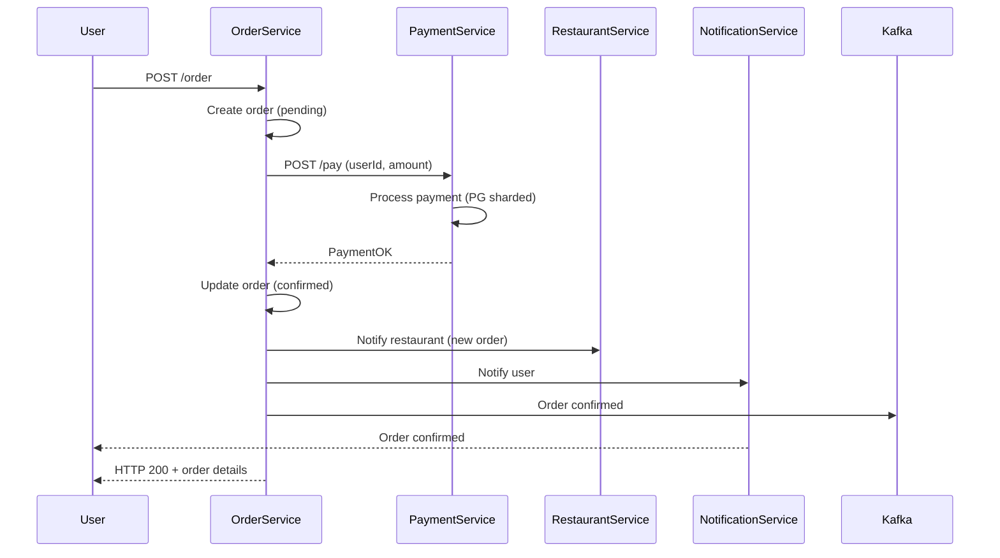

#### Payment service недоступен

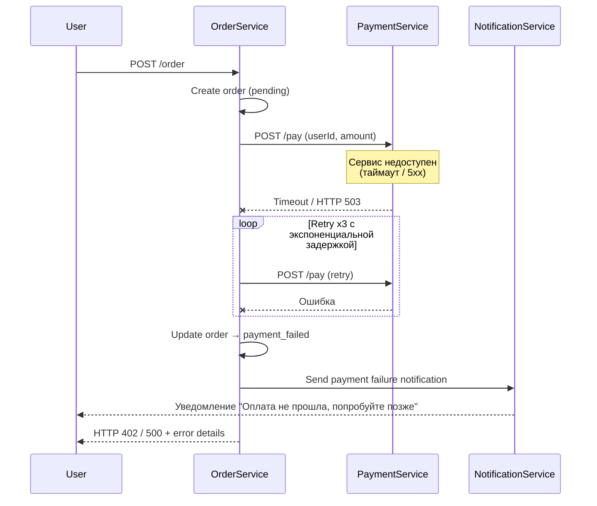

### Треккинг

#### Happy path

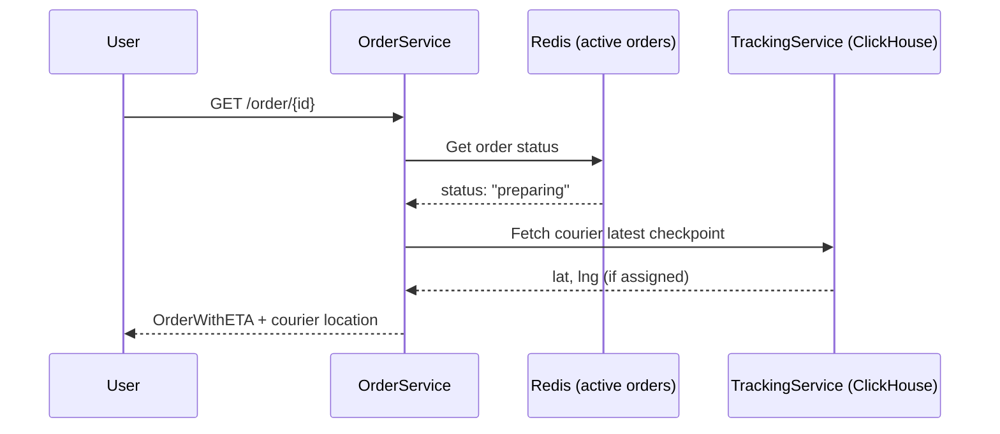

#### Redis заблокировали в России

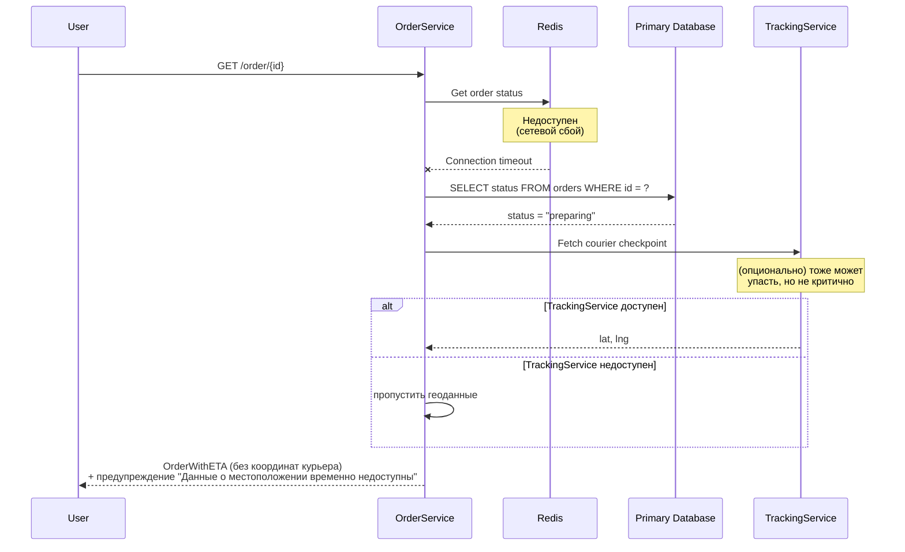

### Оплата

#### Happy path

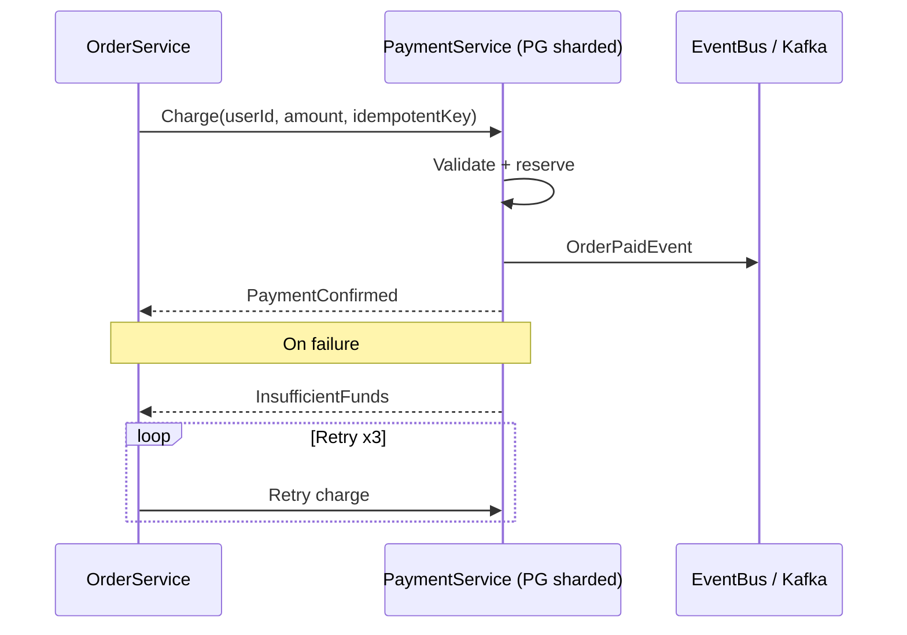

#### Ошибка сети + недостаточно средств

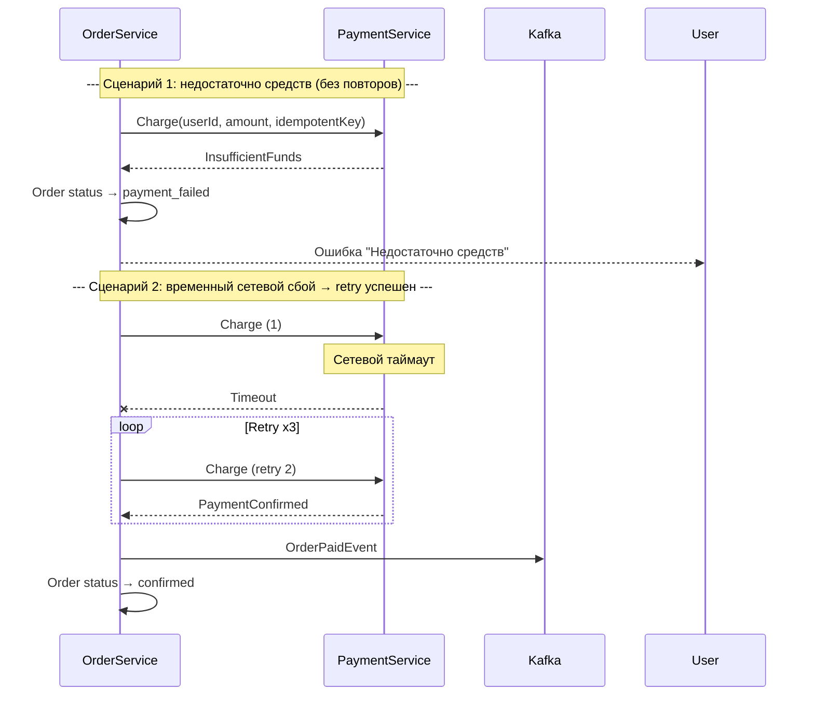

### Поиск курьера

#### Happy path

Запускается на OrderPaidEvent

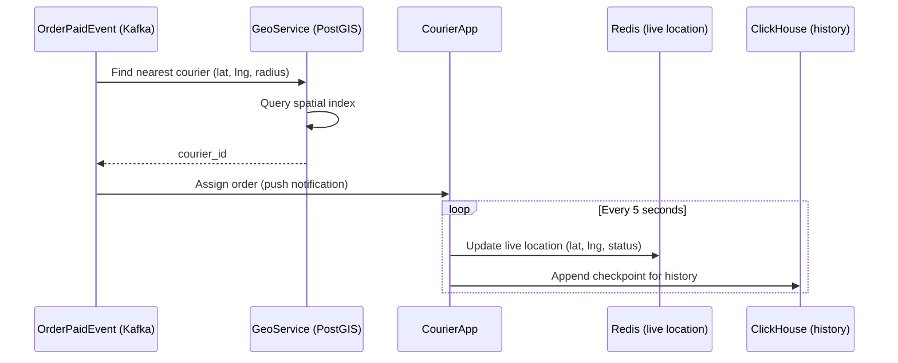

#### Недоступность geo service

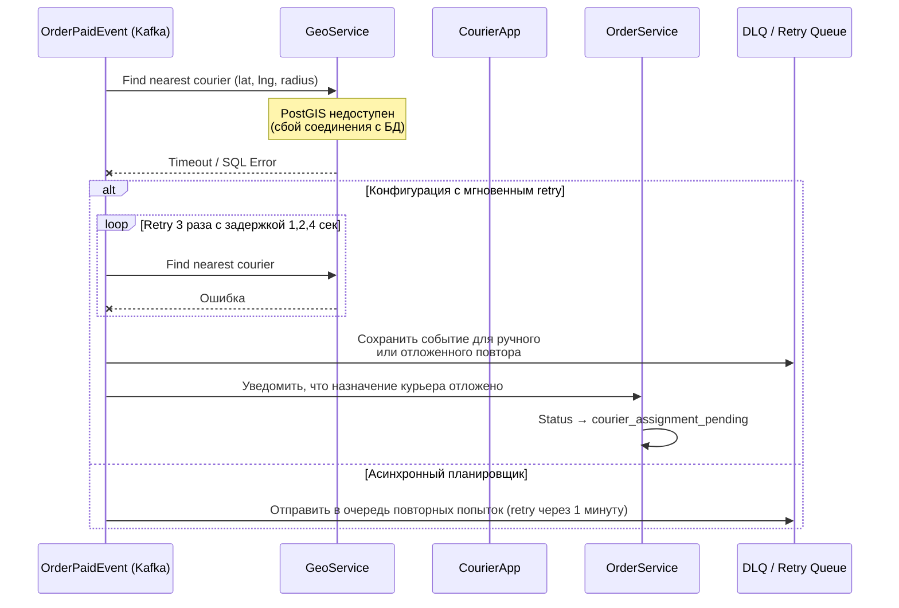

#### Отсутсвие подходящих курьеров

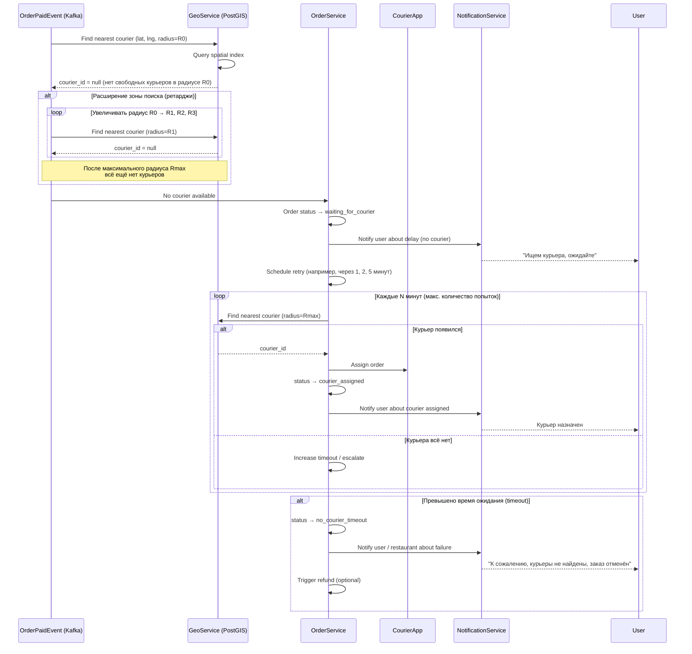

### Рестаран, подтверждение/отклонение заказа

Запускается на OrderPaidEvent

#### Happy path

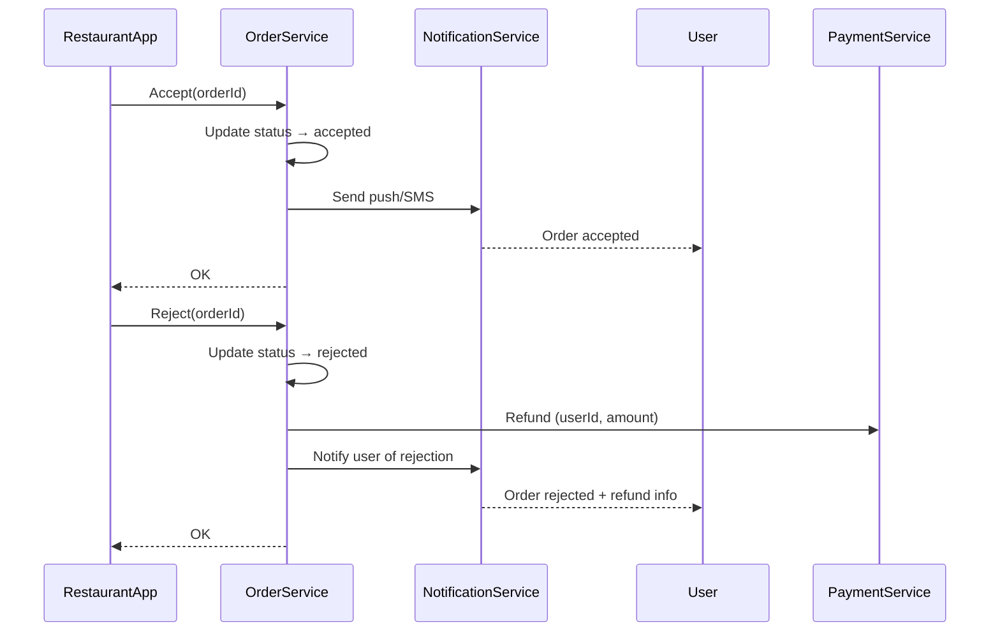

#### NotificationService не доступен

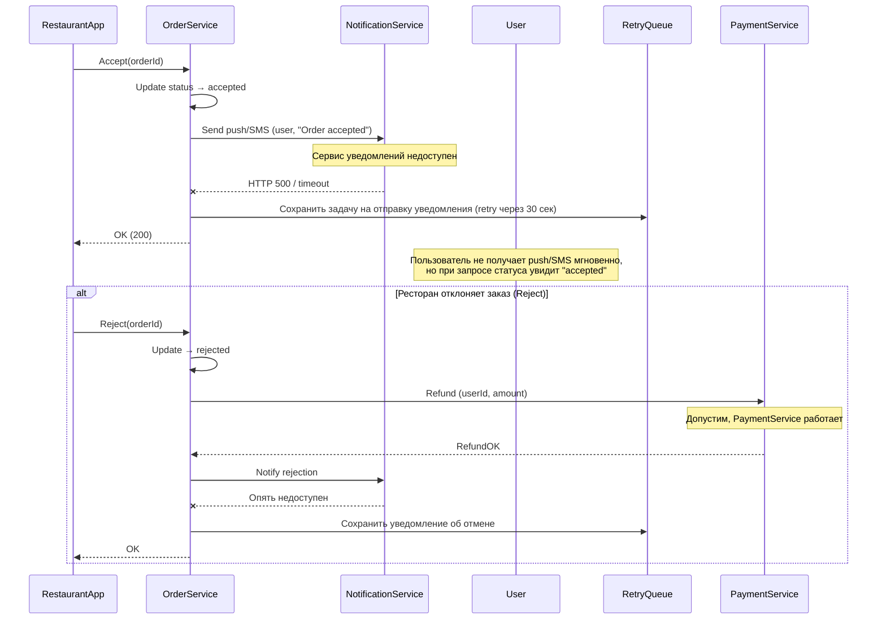

### Жизненный цикл заказа, асинхронный Сценарий

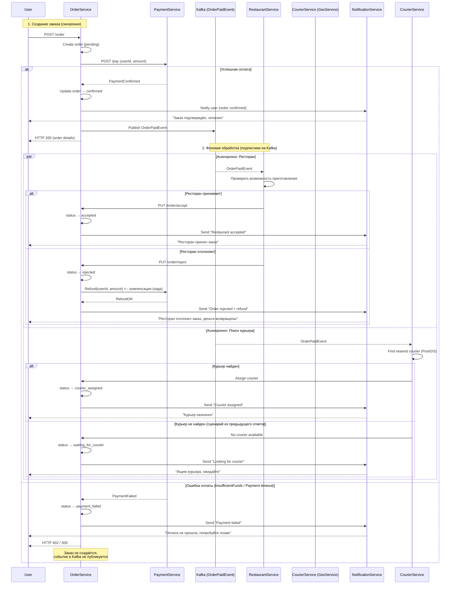
